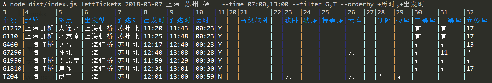
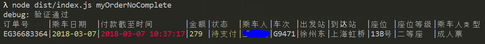
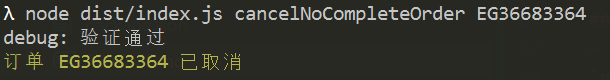
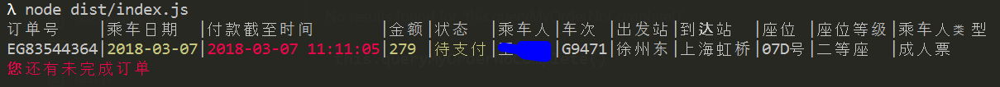

# railway-client-typescript
High speed railway client (TypeScript version)
史上最健壮 Robust 的12306抢票程序，跨站抢票，多账号抢票


## Usage
1. 安装依赖包 `npm install`

2. 查询余票信息：`node dist/index.js leftTickets 2018-03-01 上海 徐州` 车次信息将用在第三步中，

3. 更改 **./dist/index.js** 文件中的账号和乘车信息并添加车次，乘车人信息需要事先在账号中维护。

4. 订票: `node dist/index.js`，首次登录需要输入验证码，验证码文件 `./captcha.BMP`，打开验证码文件，找到答案对应的位置依次输入到命令行窗口，用 "," 或者 " " 隔开，例如：1,6,7

```
| 1 | 2 | 3 | 4 |
| 5 | 6 | 7 | 8 |
```

5. 取消排队订单：`node dist/index.js cancelOrderQueue`

### 查询余票

* `node dist/index.js leftTickets 2018-03-01 上海 徐州` 查询2018年3月1日上海到徐州的车票
* `node dist/index.js leftTickets 2018-03-01 上海 徐州 --filter G,T` 查询2018年3月1日上海到徐州的 **高铁** 和 **特快** 车票
* `node dist/index.js leftTickets 2018-03-01 上海 苏州 徐州` 查询2018年3月1日上海到苏州并且是经停 **徐州** 的车票
* `node dist/index.js leftTickets 2018-03-01 上海 苏州 徐州 --filter G` 查询2018年3月1日上海到苏州并且是经停徐州的 **高铁** 车票

输出报表数据如下：



#### Query Left Tickets Options

* `filter` | `f` : 车次过滤条件，输入部分或完整信息以`,`隔开，如 `G108,T`, `G,T`, `G`
* `time` | `t` : 出发时间范围过滤条件，输入如 `15:00,18:30`, `17:20`
* `orderby` | `o` : 按某些字段排序条件，默认递减排序，字段前加`+`符号则为递增排序，如 `历时,+出发时`

### 查询排队订单

`node dist/index.js orderWaitTime` 查询排队订单情况

### 查询未完成订单

`node dist/index.js myOrderNoComplete` 查询未完成订单情况



### 取消未完成订单

`node dist/index.js cancelNoCompleteOrder EG03398601`



### 提交订票前会自动检查未完成订单



## Develop

`npm install`

`npm start` or `node dist/index.js`

### Prerequisites:

gulp: `npm install gulp -g`

## Updates
### V0.5
1. 全面使用 [RxJS](https://github.com/Reactive-Extensions/RxJS) Observable 异步能力优化数据流程，做到最健壮 Robust 的抢票程序；
2. 新增提交订票前检查未完成订单
3. 规范控制台日志打印
4. 自动打开验证码图片

### v0.4
1. 新增定时检查用户登录状态功能，防止用户会话超时退出
2. 新增跨站订票能力
3. 新增订票成功后电脑响铃提醒
4. 利用 [RxJS](https://github.com/Reactive-Extensions/RxJS) 优化项目代码结构

### v0.3

1. 新增跨站查询余票报表
2. 简化验证码输入方式
